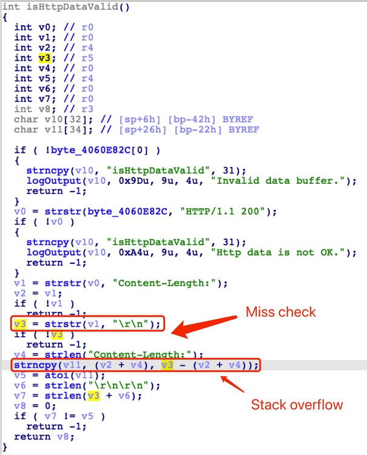

# FAST Router Vulnerability Report

FAST router have a stack overflow issue in `isHttpDataValid` function.

Local users could get remote code execution, this vulnerability currently affects latest FW, FAC, FR series, including FW325R, FAC1203R, FW326R, FR100P-AC, FAC1900R, FAC1200R, etc. It affects the linux system and vxworks system. we believe there are much more models suffered from this vuln.

## Vulnerability Description

**Threat model**: An attacker can intercept the traffic between router and Intenet. That is, an attacker can perform a man-in-the-middle attack on the router.

This vulnerability happen when `isHttpDataValid` handle data from cloud server by using `strncpy`. 

1. Attackers intercept the response from cloud server. 
2. Then attackers send a malicious response to the router. The `Content-Length ` field in this malicious response is filled a long string.
3. `isHttpDataValid` calculate the length of  `Content-Length ` field by using `strstr(v1, "\r\n")`. However, the length is not checked.
4. Finally, whole string of `Content-Length ` field is copyed to the stack by `strncpy` and lead to a stack buffer overflow to execute arbitrary code.



## PoC

```
HTTP/1.1 200 OK
Content-Type: text/html;charset=UTF-8
Content-Length: 1111111111111111111111111111111111111111111111111111111111111111111111111111111111111111111111111111
Connection: close
Cache-control: no-cache

1111111111111111111111111111111111111111111111111111111111111111111111111111111111111111111111111111
```

## Acknowledgment

Credit to [@G6](https://github.com/GANGE666), [@Yu3H0](https://github.com/Yu3H0/), [@Pyro](https://github.com/Le0nn) from Shanghai Jiao Tong University.