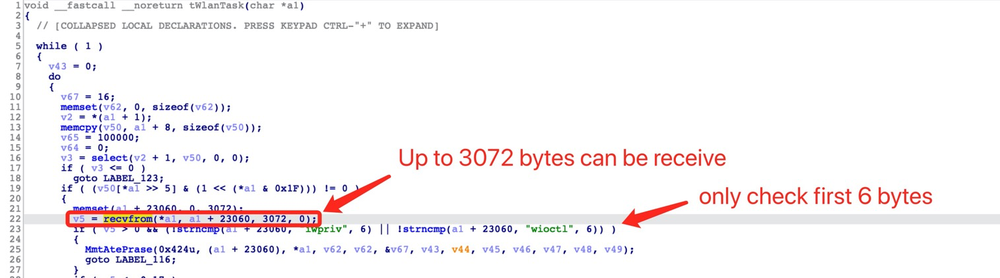
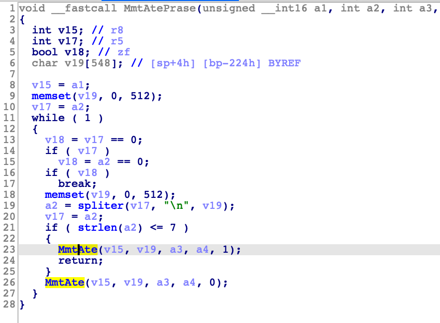
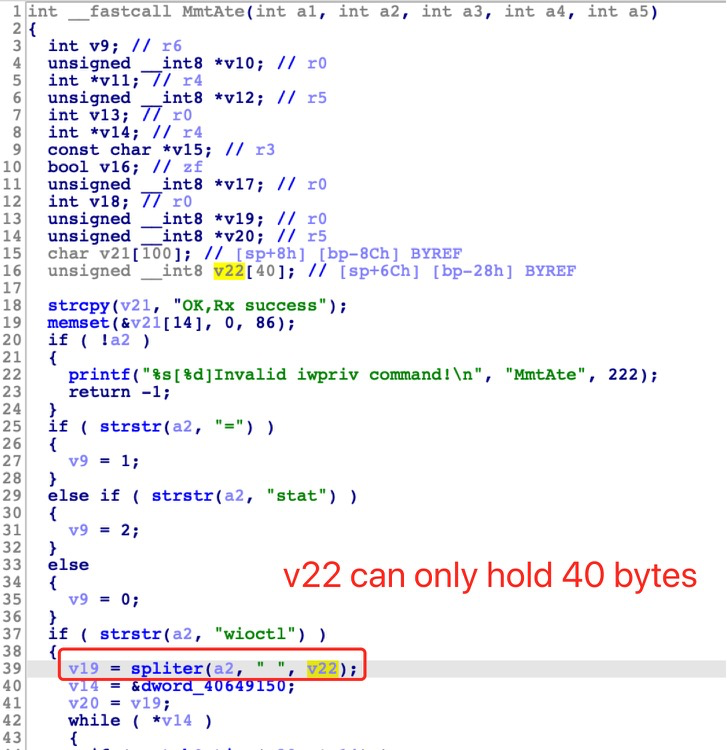
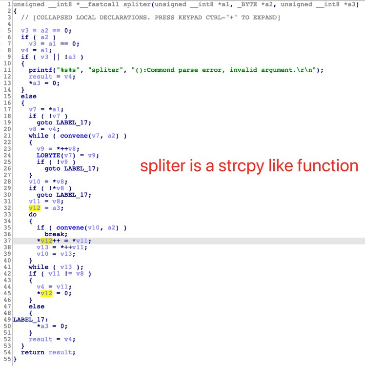

# TP-Link Router Vulnerability Report

## Timeline

- 2021.10.24	  We pwned TP-Link WDR7660(v2.0.38) at [GeekPWN 2021](https://2021.geekpwn.org/zh/index.html)
- 2022.4.16        CNVD-2022-21793 assigned 
- 2022.5.10        CVE-2022-26988 assigned 


TP-Link router have a stack overflow issue in `MntAte` function.

Local users could get remote code execution, this vulnerability currently affects latest WDR series, including WDR5660, WDR7620, WDR7660, WDR7661, etc. We believe there are much more models suffered from this vuln.

## Product information

WDR7660 <= 2.0.38, fixed in 3.0.4

This vulnerability also exists in some TP-Link, FAST, and Mercury series routers.

## Vulnerability Description

This vulnerability happen when `MntAte` receive a malicious string by using `recvfrom` from `UDP port 1060`. 

1. The malicious input(`a1+23060`) is provided by attackers and the length of malicious input is up to 3072 bytes. 
2. The first 6 bytes must be "iwpriv" or "wioctl"
3. And then, the malicious input(`a1+23060`) deliver to `MmtAteParse` and `MntAte` function.
4. `MntAte` will use `spliter` for truncate the input data. But `spliter` is a `strcpy` like function. No length limitation in `spliter`.
5. However, `MntAte` copy these data to a stack buffer without checking the length and lead to a stack buffer overflow to execute arbitrary code.










## PoC

```python
from pwn import *
r = remote("192.168.1.1", 1060, typ="udp")
payload = "iwpriv" + "A"*40 + "\n"
r.send(payload)

```

## Acknowledgment

Credit to [@G6](https://github.com/GANGE666), [@Yu3H0](https://github.com/Yu3H0/), [@Pyro](https://github.com/Le0nn) from Shanghai Jiao Tong University.